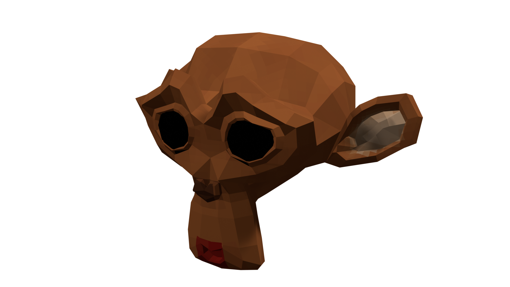

# Rotable Monkey for Minetest

This is an example mod that includes a rotatable monkey head node that can be
rotated with a monkey head rotator tool. You should feel free to reference
this mod for making your own degrotate nodes. 

When wielding a monkey rotator:
* Punch (left-click) to rotate clockwise.
* Place (right-click) to rotate anticlockwise.
* Hold sneak to rotate in increments of 22.5°.
* Hold Aux1 (special) to rotate in increments of 45°. Sneak takes precedence
over Aux1.

## Copyright

This software is licensed under The 3-Clause BSD License, see LICENSE for
details.

Unless you use the code verbatim or with insubstantial changes, I think you will
not need to follow this mod's license anyway due to the transformative nature of
any changes and the short length of the code. I am not a lawyer. Regardless I
have given it a permissive license due to its rudimentary nature where I usually
prefer copyleft.

So far as I know, the "Suzanne" monkey head included in Blender is considered
the same as all of their other primitives and therefore its direct use in this
mod does not require a licence since it is considered my "own work"; please
correct me if you think this is in error.
